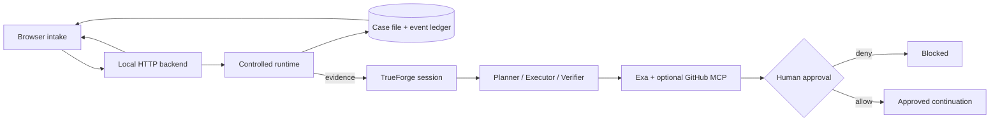

# CI Failure Surgeon

> **In 30 seconds:** CI logs are noisy and autonomous repair is risky. CI Failure Surgeon turns a failure report, repository path, and test command into a durable evidence ledger: plan → bounded reproduction → diagnosis → independent verification → explicit write approval. It is a reusable workflow, not a JWT-only demo.

**Built with TrueForge · Team agent-i · [Bhanu Nagpure](https://github.com/bhanu-dev82)**

The bundled `fixture/auth-service` makes the story immediately reproducible: its verifier checks an HMAC signature but intentionally omits expiration enforcement. Therefore **`npm run test:fixture` is expected to report exactly one failing assertion** (`200 !== 401`). That expected incident demonstrates the product; it is not a failing product test.

## Why it is controlled

- The operator supplies a workspace-relative repository and an allowlisted test command.
- Reproduction uses no shell. It prefers a configured rootless, read-only, network-disabled container; otherwise an ephemeral detached worktree; finally a clearly labeled bounded host process.
- Evidence, state transitions, runtime facts, and approval decisions are persisted locally.
- Analysis receives reproduction evidence and may draft a change, but mutation-capable TrueForge sandbox tools are deliberately disabled in this version.
- Every MCP tool classified `@write` or `@destructive` requires TrueForge approval. This app never commits, pushes, merges, or changes a PR by itself.
- Provider, MCP, and GitHub secrets are removed from child-process environments and redacted from evidence/browser responses.

## TrueForge capabilities used

| Capability | Concrete use |
|---|---|
| TypeScript SDK | Health checks, agent/session creation, streamed turns, and approval continuation |
| AgentSpec | Runtime model selection and instructions assembled per session |
| Dynamic subagents | `planner`, `executor`, and `independent-verifier` roles |
| MCP connectors | Deferred-schema (`preload: false`) Exa research; optional GitHub connector |
| Tool approvals | `@write` and `@destructive` MCP calls pause for an operator decision |
| Generative UI | Enabled for concise investigation summaries |
| Context management | Large-response handling and compaction enabled |
| Turn metrics | TrueForge `turn.done.state.metrics` feeds usage reporting |
| Session-level routing | Runtime catalog reconciliation; quota failover starts a new session because models are session-bound |

**Truthful fallback:** if TrueForge is not reachable, the same browser still performs controlled reproduction, persists evidence, and labels the run **LOCAL-ONLY**. It does **not** claim model, subagent, MCP, research, sandbox, patch-generation, or approval activity. This is the reliable judging path when credentials or provider quota are unavailable.

## Architecture



The backend is authoritative; the UI renders snapshots plus server-sent events. See [architecture and controls](docs/architecture.md).

## Setup

Prerequisite: Node.js 22+.

### Credential-free local demo (recommended first)

```bash
npm ci
npm run verify
npm run build
npm run demo
```

Open <http://127.0.0.1:8787>, confirm **LOCAL-ONLY**, then select **Start investigation**. The fixture exits 1 by design and the ledger explains why.

### TrueForge-enhanced demo

1. Start your local TrueForge runtime and configure a model that appears in its live model catalog.
2. Copy `.env.example` to `.env`; set `TRUEFORGE_API_URL` and the required provider key. Exa, GitHub, and Daytona credentials are optional.
3. Set `MODEL_NAME`, `MODEL_DEEP`, and `MODEL_FAILOVER_CHAIN` to IDs exposed by that runtime. The checked-in values are examples from the development environment, not promises about another account's availability or quota.
4. Run `npm run demo` and inspect `/api/health` before making capability claims.

`npm run dev` is the separate CLI path and requires reachable TrueForge. `DEMO_AUTO_APPROVE` must remain `false` for judging.

## Three-minute judge path

Use [the exact storyboard](docs/demo-script.md). In short:

1. Show the capability strip and control boundary.
2. Start the prefilled expired-token incident.
3. Point out command, exit code, runtime mode, and the intentionally failing assertion.
4. Explain LOCAL-ONLY truthfulness, or—when TrueForge is reachable—show the three roles and a gated write; choose **Deny** for a zero-mutation demo.
5. Finish with `npm run verify`, build, audit, and Qodo PR evidence.

### Screenshot capture

No screenshot is committed: the live console contains run-specific paths/timestamps and a static image can become stale. Capture locally after starting the server:

```bash
mkdir -p /tmp/ci-surgeon-shots
npx --yes playwright screenshot --viewport-size="1440,1000" \
  http://127.0.0.1:8787 /tmp/ci-surgeon-shots/incident-dossier.png
```

Review the image for paths or private data before copying a selected, compressed asset into `docs/images/`.

## Verification

```bash
npm run verify       # typecheck + product suite; baseline: 46/46
npm run build        # compile to dist/
npm audit --omit=dev # production dependency audit; baseline: 0 vulnerabilities
npm run test:fixture # EXPECTED: 2 pass, 1 fail (the demonstration incident)
```

The baseline above was rechecked during submission preparation; run it again in the recording environment. Generated `dist/`, runtime `.ci-surgeon/`, `audit/`, `.env`, `node_modules/`, and screenshots with unreviewed data remain excluded.

## Qodo PR #1 evidence

[PR #1](https://github.com/bhanu-dev82/trueforge_hackathon_bhanu/pull/1) is the public, open review from `feature/ci-failure-surgeon` into `main`. It contains two commits and Qodo review threads. Qodo identified approval/sandbox and reliability issues, including **“Sandbox writes bypass approval”** and **“Approval consumed before success.”** Commit `695ff29` is the public follow-up addressing the first review round: write/destructive approval selectors, error propagation, retry accounting, pending-approval handling, durable completion events, UUID run identity, and cumulative token budgeting. The current local working tree adds further uncommitted hardening and documentation; do not imply Qodo has reviewed those changes until a new review is requested after publication.

## Known limitations

- TrueForge-enhanced behavior depends on a separately running local runtime, its configured provider/catalog, and quota.
- Mutation-capable TrueForge sandbox execution is disabled; isolation here is the local controlled-runtime selection described above.
- The local-only path preserves and verifies evidence but intentionally generates no patch.
- Approval continuation is live-process state; persisted cases can be read after restart, but an interrupted TrueForge approval cannot yet be resumed.
- The app binds to loopback and is a local demo, not a multi-user service.
- The UI shows the latest case remembered by that browser; clear local storage to start without that pointer.

## Repository map

`src/` orchestration/backend · `public/` judge console · `fixture/` intentional incident · `skills/` reusable playbook · `tests/` product tests · `docs/` architecture/demo/submission evidence

AI coding assistance was used; the author reviewed the implementation and can explain its decisions. Licensed under [MIT](LICENSE).
